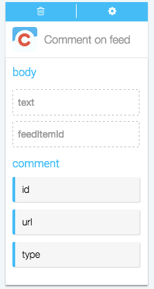
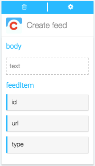
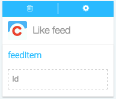

####What kind of Actions can I take in Chatter?

Actions are the automatic steps you can take with an app. Creating or modifying a record, posting to social media, running analytics: if your app can do it, Azuqua can do it. 

1. Set up your Flõ. Actions only work after you've set up a starting Event, so make sure you've done that first. [Here's how you can start a Flõ with Chatter]().
2. Find Chatter in the Channels menu on the right-hand side of the designer and click it to display the list of Actions.
3. Click on the Action you want to use to add the card to the designer. 
4. Configure the card. You can choose an existing configuration from the drop-down menu or [create a new configuration](). Once this is done the card will flip over automatically. 
5. Now, you can drag data into the input fields and drag the results to empty fields on other cards. Read more about how each action works below.

**Comment on Feed** 

</img>  

This action lets you post a new comment on an item in your feed. You can use this Action to respond to a new item on a feed by dragging the feedItemId from the Chatter "Poll My Feed" Event card. Add Functions like the "Continue If" Function to only post a comment when certain conditions are met. 

*Input fields* :

* text, the text of the comment you want to post   
* feedItemId, the unique numeric ID of the feed Item you're responding to

*Output data* : 

* id, the unique numeric id of the comment you are posting
* url, the url of the comment you are posting
* type 

<!---What's type?--->
  
  

**Create Feed**

</img>

This action lets you post a new message to your feed. You can use this Action to automatically post news or updates to your whole feed. Use the Concatenate Function to add a message to a URl from another Channel, then drag the result to the Input field.

*Input fields*:

* text, the text of the message you want to post

*Output data*:  

* id, the unique numeric id of the feed item you're posting
* url, the URl of the feed item you're posting
* type 

<!---I looked this up, only to realize it's redundant the only one type that will ever return due to the inputs is TextPost--->

**Like Feed**

</img>

This action lets you automatically like a post on your chatter feed. Combine it with the "Poll Feed" Event and "Continue If" Function to like everything your boss posts.

*Input fields*:

* ID, the unique numberic id of the feed item you want to post.  

