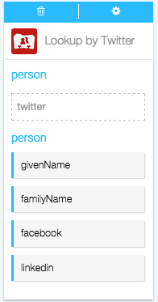

####What kind of Actions can I take in Full Contact?

Actions are the automatic steps you can take with an app. Creating or modifying a record, posting to social media, running analytics: if your app can do it, Azuqua can do it. 

1. Set up your Flõ. Actions only work after you've set up a starting Event, so make sure you've done that first. [Here's how you can start a Flõ with Full Contact]().
2. Find Full Contact in the Channels menu on the right-hand side of the designer and click it to display the list of Actions.
3. Click on the Action you want to use to add the card to the designer. 
4. Configure the card. You can choose an existing configuration from the drop-down menu or [create a new configuration](). Once this is done the card will flip over automatically. 
5. Now, you can drag or type data into the input fields and drag the results to empty fields on other cards. Read more about how each action works below.

**Lookup by Email**

</img>

Look up a contact's full information using their email. 

*Input fields*

* email, the email of the person whose contact information you want to look up

*Output data*

* givenName, the first name associated with this email
* familyName, the last name associated with this email
* twitter, the Twitter handle associated with this email
* facebook, the URl of the facebook associated with this email
* LinkedIn, the URl of the LinkedIn profile associated with this email

**Lookup by Phone**

Look up a contact's full information using their phone number. 

</img>

*Input fields*

* phone, the phone number of the person whose contact information you want to look up

<!---what format does the phone number need to be in, or does it matter?--->

*Output data*

* givenName, the first name associated with this phone number
* familyName, the last name associated with this phone number
* twitter, the Twitter handle associated with this phone number
* facebook, the URl of the facebook associated with this phone number
* LinkedIn, the URl of the LinkedIn profile associated with this phone number

**Lookup by Twitter**

</img>

Look up a contact's full information using their Twitter handle. 

*Input fields*

* twitter, the Twitter handle of the person whose contact information you want to look up

<!---another format question, does it need the @ before it to work?--->

*Output data*

* givenName, the first name associated with this phone number
* familyName, the last name associated with this phone number
* facebook, the URl of the facebook associated with this phone number
* LinkedIn, the URl of the LinkedIn profile associated with this phone number
