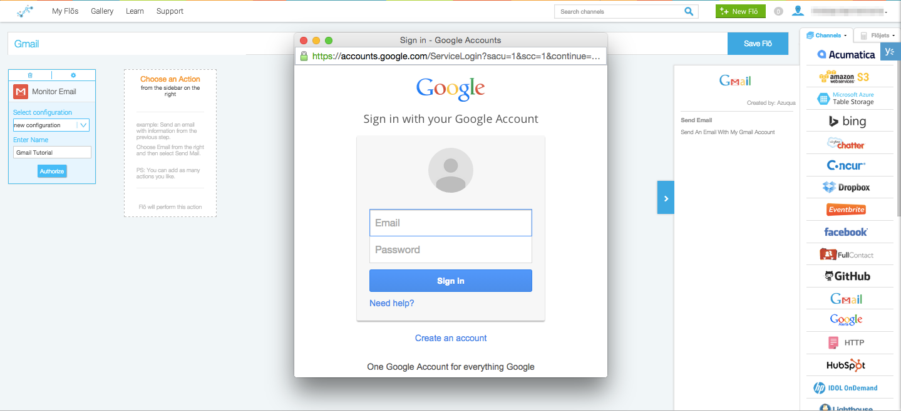

1. From the dropdown menu on the Gmail card, select “new configuration.”  If you don’t see this menu, click the gear in the corner of the card to flip it over.
2. Enter a name for this Channel configuration (e.g. “Azuqua Gmail”) and click “Authorize.” 
3. Enter your Gmail account details into the pop-up window and click “Log In.” If you are already signed into Gmail on this computer, Gmail will automatically give us your account information and you can skip this step.
</img>
4. Click "Accept" to give Azuqua access to your account information.

Now, you can use this configuration every time you create a Flõ. You can also create multiple configurations for each channel to link all your accounts to Azuqua. [Read more about managing your configurations from the Settings page.]()
