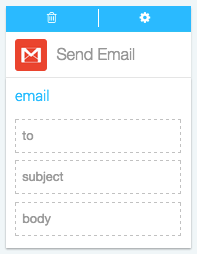

####What kind of Actions can I take in Gmail?

Actions are the automatic steps you can take with an app. Creating or modifying a record, posting to social media, running analytics: if your app can do it, Azuqua can do it. 

1. Set up your Flõ. Actions only work after you've set up a starting Event, so make sure you've done that first. [Here's how you can start a Flõ with Gmail]().
2. Find Gmail in the Channels menu on the right-hand side of the designer and click it to display the list of Actions.
3. Click on the Action you want to use to add the card to the designer. 
4. Configure the card. You can choose an existing configuration from the drop-down menu or [create a new configuration](). Flip the card over by pressing the gear symbol in the corner.
5. Now, you can drag or type data into the input fields and drag the results to empty fields on other cards. Read more about how each action works below.

**Send Email**

</img>

Use this action to automatically send an email when your Flõ runs. This action is useful for sending emails to subscribers or team members when a certain event occurs in another app. 

*Input fields*

* to, the address where you want to send an email
* subject, the subject of the email
* body, the body of your email