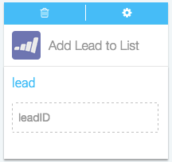
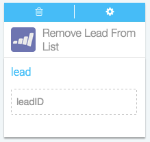
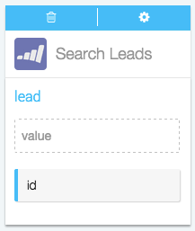

####What kind of Actions can I take in Marketo?

Actions are the automatic steps you can take with an app. Creating or modifying a record, posting to social media, running analytics: if your app can do it, Azuqua can do it. 

1. Set up your Flõ. Actions only work after you've set up a starting Event, so make sure you've done that first. [Here's how you can start a Flõ with Marketo]().
2. Find Marketo in the Channels menu on the right-hand side of the designer and click it to display the list of Actions.
3. Click on the Action you want to use to add the card to the designer. 
4. Configure the card. You can choose an existing configuration from the drop-down menu or [create a new configuration](). Once this is done the card will flip over automatically. 
5. Now, you can drag or type data into the input fields and drag the results to empty fields on other cards. Read more about how each action works below. 

**Add Lead to List**

</img>

Use this action to add an existing lead to a list in Marketo. After you've cconfigured Marketo, you will be able to choose the list you would like to work with from a drop-down menu. 

*Input fields:*

* `leadID`, the unique numeric ID of the lead you want to add to the list

**Create/Update Lead**

</img>

Use this action to add a new lead to Marketo, or to update an existing lead with new information.

*Input fields:*

* `email`, the email of the lead you would like to add or update
* `firstName`, the first name of the lead you would like to add or update
* `lastName`, the last name of the lead you would like to add or update
* `middleName`, the middle name of the lead you would like to add or update
* `city`, the city of the lead you would like to add or update
* `state`, the state of the lead you would like to add or update
* `postalCode`, the postal code of the lead you would like to add or update
* `phone`, the phone number of thelead you would like to add or update

*Output data:*

* `id`, the unique numeric ID of the lead you have just created or updated within Marketo

**Remove Lead from List**

</img>

Use this action to remove an existing lead grom a list in Marketo. After you've cconfigured Marketo, you will be able to choose the list you would like to work with from a drop-down menu. 

*Input fields:*

* `leadID`, the unique numeric ID of the lead you want to remove from the list

**Search Leads**

</img>

USe this action to search for existing leads

<!---What kind of search values does this take? How will it will return results?--->

*Input fields:*

* `value`

*Output data:*

* `id` 