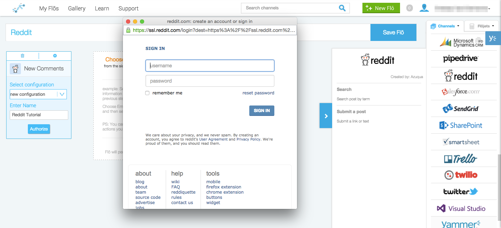

<head>
<meta name="tags" content="Done">
</head>

####How do I configure Reddit?

1. From the dropdown menu on the Reddit card, select “new configuration.”  If you don’t see this menu, click the gear in the corner of the card to flip it over.
2. Enter a name for this Channel configuration and click “Authorize.” If you’re already logged into Reddit on this computer (cool, us too) then Reddit will automatically give us your account information. 
3. Enter your account details in the pop-up window and click “Sign In.”
</img>

Now, you can use this configuration every time you create a Flõ by selecting it from the dropdown menu. You can also create multiple configurations for each channel to link all your accounts to Azuqua. [Read more about managing your configurations from the Settings page.]()