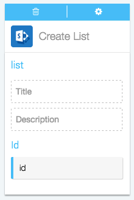

Actions are the automatic steps you can take in an app using Azuqua. Creating or modifying a record, posting to social media, runni/Users/chelseasanclemente/azuqua/help/channels/SharePoint/What kind of Actions can I take in SharePoint?.mdng analytics: if your app can do it, Azuqua can do it. 

1. Set up your Fl&otilde. Actions only work after you've set up a starting Event, so make sure you've done that first. [Here's how you can start a Fl&otilde with *Channel*]().
2. Find *Channel* in the Channels menu on the right-hand side of the designer and click it to display the list of Actions.
3. Click on the Action you want to use to add the card to the designer. 
4. Configure the card. You can choose an existing configuration from the drop-down menu or [create a new configuration](). Once this is done the card will flip over automatically. 
5. Now, you can drag or type data into the input fields and drag the results to empty fields on other cards. Read more about how each action works below.

**Create List**

Use this action to create a new list in SharePoint. 

*Input fields:*

* `Title`, the title of the list you want to create
* `Description`, the desciption of the list you want to create

*Output data:*
* id, the unique numeric ID of the list you have just created

</img>

**Read Item**

<!---Need SharePoint access to get screenshot--->

Uses the ID of an item in SharePoint to get data about the item. 

*Input fields:*

* `id`, the uniqu numeric ID of the item you want to read

*Output data:*

The output data is generated based on the attributes of the item you are trying to read. Some of the data you can get includes the list of attachments, content type, display name, permissions, the folder, parent list, and role assignments for that item. 

****

<

