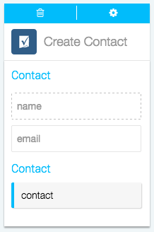
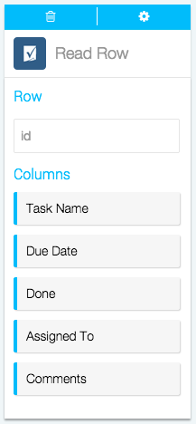

Actions are the automatic steps you can take in an app using Azuqua. Creating or modifying a record, posting to social media, running analytics: if your app can do it, Azuqua can do it. 

1. Set up your Fl&otilde. Actions only work after you've set up a starting Event, so make sure you've done that first. [Here's how you can start a Fl&otilde with Smartsheet]().
2. Find *Channel* in the Channels menu on the right-hand side of the designer and click it to display the list of Actions.
3. Click on the Action you want to use to add the card to the designer. 
4. Configure the card. You can choose an existing configuration from the drop-down list or [create a new configuration](). Once you've configured the card, you can select the sheet you want to modify from the second drop-down list.
5. Now, you can drag or type data into the input fields and drag the results to empty fields on other cards. Read more about how each action works below.

**Add Row**

Use this action to add a Row to an existing Smartsheet. 

*Input fields:* 

Azuqua will automatically generate input fields based on the names of your columns. The example card on the right shows the input fields that will be generated from Smartsheet's default task sheet. 

*Output data:*

* `id`, the unique numeric ID of the row you've just created

</img>

**Create contact**

Use this action to create a contact in Smartsheet so you can share tasks and sheets with your network.

*Input fields:*

* `name`, the name of the contact you want to create
* `email`, the email of the contact you want to create

*Output data:*
* `contact` 

</img>

**New Column**

Use this action to create a new column in Smartsheet

*Input fields:*

* `title`, the title of the column
* `type`, the type of the column. Text/Number, Contact List, Date, Dropdown List (custom, RYG, Harvey Ball, and Priority types) and Checkbox (checkbox, star, and flag types). These types are referred to as  the following constant values in the API: TEXT_NUMBER, CONTACT_LIST, DATE, PICKLIST, and CHECKBOX.

</img>

**Read Row**

Use this  action to read data from a row.

*Input fields:*

* `id`, the unique numeric ID of the row you want to read in Smartsheet

*Output data:*

Azuqua will automatically generate output data based on the names of your columns. The example card on the right shows the output data that will be generated from Smartsheet's default task sheet. 

</img>

**Search by Column**

Use this action to search a Smartsheet by column. 

</img>